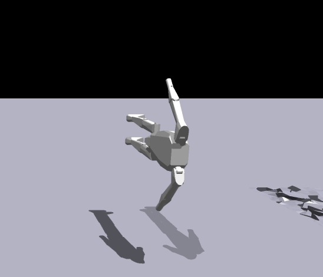

# Quaternion Rotation Examples of the MK1 Robot in its environments

## Upright facing Pos X
Quaternion 0 0 0 1

## Upright facing Neg X
Quaternion 0 0 1 0

## Upright facing Pos Y
Quaternion 0 0 1 1

## Upright facing Neg Y
Quaternion 0 0 -1 1

## Inbetween Example

Quaternion 0 0 1 2

## Upside down  and other examples

Quaternion 1 0 1 0 

Quaternion 0 1 0 0 

Quaternion 1 -1 0 0 

Quaternion 1 0 0 0 

